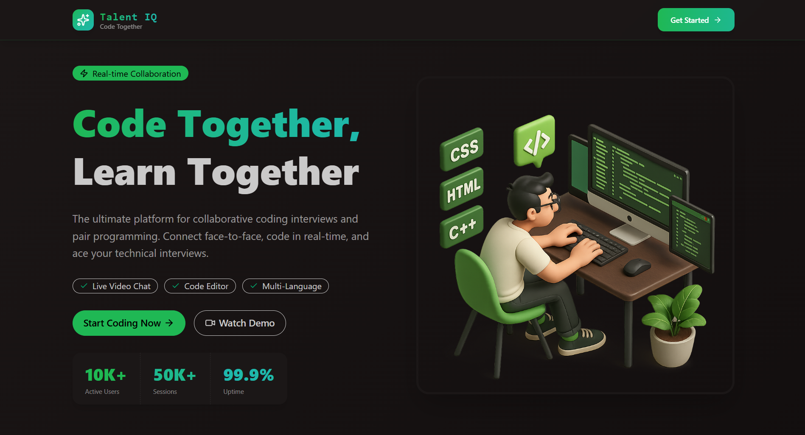
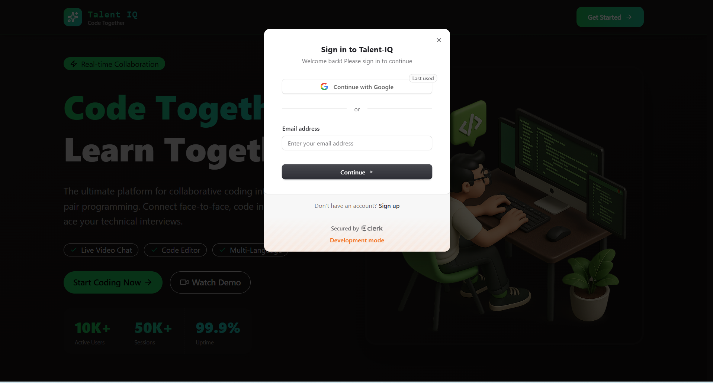
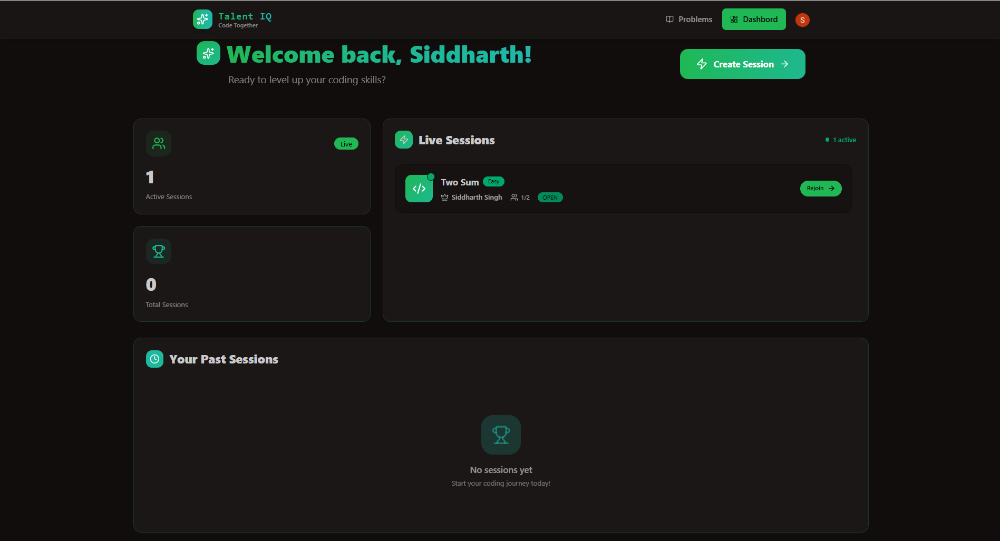
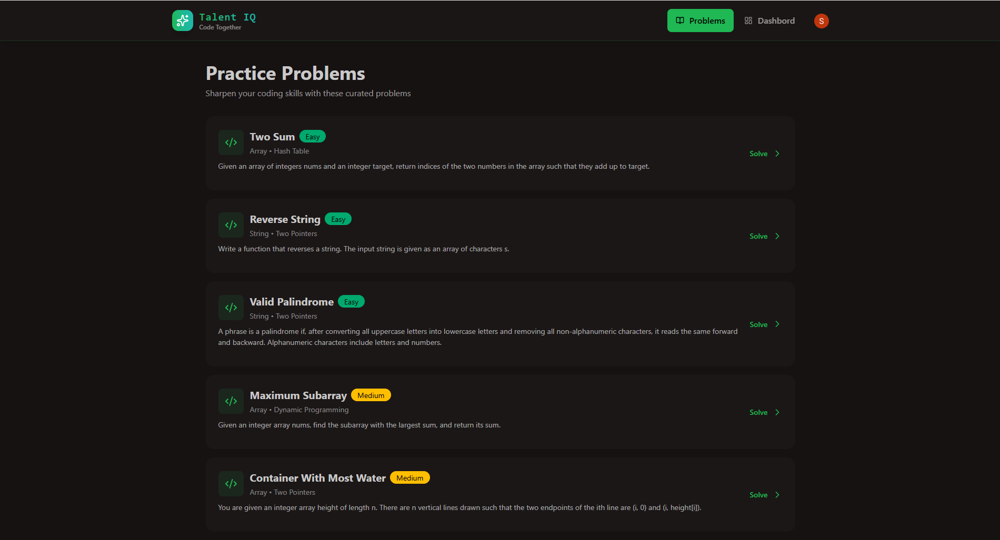
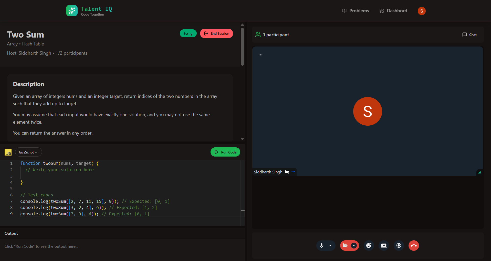
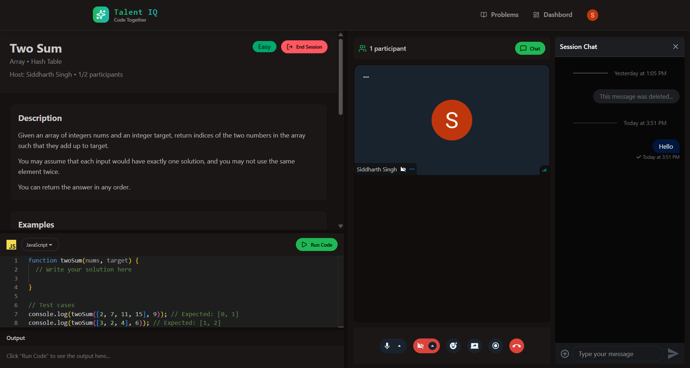

# Talent-IQ

> **A real-time technical interview platform for collaborative coding interviews with video, chat, live code execution, and automated evaluation.**



Talent-IQ is a full-stack technical interview platform that provides a complete environment for conducting **1-on-1 coding interviews**. Interviewers and candidates can communicate through video and chat, collaborate during coding sessions, share screens, execute code, and evaluate solutions using test cases.

The project integrates multiple services — **Clerk, Stream, JDoodle, Inngest, MongoDB, and TanStack Query** — into a single full-stack application.

---

## 🚀 Features

### 🔐 Authentication

* Authentication and authorization using **Clerk**
* Protected backend APIs
* Authenticated user and interview workflows



### 📊 Dashboard

* Interview and session statistics
* Interview history
* Real-time session information



### 💻 Coding Environment

* VS Code-powered **Monaco Editor**
* Multi-language code execution
* Backend-integrated **JDoodle API**
* Automated test-case evaluation
* Success/failure feedback
* Dedicated practice problems for solo coding



### 🎥 Real-Time Interviews

* Private **1-on-1 interview rooms**
* Real-time video communication using **Stream Video SDK**
* Mic and camera controls
* Screen sharing
* Session recording
* Room locking with a maximum of 2 participants



### 💬 Real-Time Chat

* Real-time messaging using **Stream Chat SDK**
* Integrated directly into the interview environment



### ⚡ Background Processing

* Asynchronous background jobs using **Inngest**
* Event-driven processing without blocking API requests

### 🔄 Data Management

* **TanStack Query** for server-state management
* API caching and synchronization

---

## 🏗️ Architecture

```text
                    ┌─────────────────────┐
                    │      React App      │
                    │                     │
                    │  Monaco Editor      │
                    │  TanStack Query     │
                    └──────────┬──────────┘
                               │
                         REST API
                               │
                               ▼
                    ┌─────────────────────┐
                    │   Node.js + Express │
                    │      Backend        │
                    └──────────┬──────────┘
                               │
              ┌────────────────┼────────────────┐
              │                │                │
              ▼                ▼                ▼
        ┌──────────┐     ┌──────────┐     ┌──────────┐
        │ MongoDB  │     │ JDoodle  │     │ Inngest  │
        │ Database │     │   API    │     │  Jobs    │
        └──────────┘     └──────────┘     └──────────┘

              ┌──────────────────────────────┐
              │            Clerk             │
              │ Authentication & Authorization│
              └──────────────────────────────┘

              ┌──────────────────────────────┐
              │            Stream             │
              │     Video + Chat + Realtime  │
              └──────────────────────────────┘
```

---

## 🛠️ Tech Stack

| Category         | Technology              |
| ----------------- | ------------------------ |
| Frontend          | React.js, Tailwind CSS   |
| Code Editor       | Monaco Editor            |
| Backend           | Node.js, Express.js      |
| Database          | MongoDB                  |
| Authentication    | Clerk                    |
| Video & Chat      | Stream SDK               |
| Code Execution    | JDoodle API              |
| Server State      | TanStack Query           |
| Background Jobs   | Inngest                  |
| API               | REST                     |
| Version Control   | Git & GitHub             |

---

## ⚙️ Getting Started

**1. Clone the repository**
```bash
git clone https://github.com/sidd-singh04/talent-IQ.git
cd talent-IQ
```

**2. Install dependencies**
```bash
cd frontend && npm install
cd ../backend && npm install
```

**3. Set up environment variables**

Copy `.env.example` to `.env` in both `frontend/` and `backend/`, and fill in your own credentials for Clerk, Stream, JDoodle, MongoDB, and Inngest.

**4. Run the app**
```bash
# in backend/
npm run dev

# in frontend/ (separate terminal)
npm run dev
```

The app will be available at `http://localhost:5173` (or whichever port your frontend dev server prints).

---

## 🧠 Technical Highlights

* Built an end-to-end **real-time technical interview platform**.
* Integrated multiple third-party services into a single application.
* Designed REST APIs using **Node.js and Express**.
* Implemented authenticated backend workflows using **Clerk**.
* Built a browser-based coding environment using **Monaco Editor**.
* Integrated backend code execution through **JDoodle**.
* Implemented automated solution evaluation using test cases.
* Built 1-on-1 video, chat, and screen-sharing functionality using **Stream**.
* Implemented room restrictions to maintain the 2-participant interview model.
* Used **TanStack Query** for server-state management and caching.
* Used **Inngest** for asynchronous background processing.
* Kept service credentials and application configuration in environment variables.

---

## 🔐 Security & Configuration

Sensitive credentials are managed through environment variables rather than being hardcoded in the source code.

Configuration includes:

* Clerk credentials
* Stream credentials
* JDoodle credentials
* MongoDB connection string
* Inngest configuration
* Frontend/backend URLs

A `.env.example` file documents the required environment variables without exposing actual credentials.

---

## 🎯 Project Focus

Talent-IQ was built to gain practical experience with the architecture of a modern full-stack application, including full-stack development, REST API design, authentication & authorization, database integration, real-time communication, third-party API integration, code execution and evaluation, server-state management, background job processing, and production deployment.

---

## 👨‍💻 Author

**Siddharth Singh**
GitHub: [@sidd-singh04](https://github.com/sidd-singh04)
